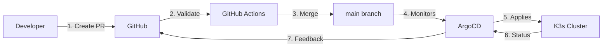

# Deployment Workflow

This document describes how changes are deployed from development to production using GitHub Actions and ArgoCD.

**Last Updated:** November 2025
**Status:** Production
**GitOps Enabled:** Yes

---

## Table of Contents

1. [Overview](#overview)
2. [Architecture](#architecture)
3. [GitHub Actions Workflow](#github-actions-workflow)
4. [ArgoCD Configuration](#argocd-configuration)
5. [Deployment Process](#deployment-process)
6. [Security Considerations](#security-considerations)
7. [Troubleshooting](#troubleshooting)

---

## Overview

### Deployment Flow

```
Developer → GitHub PR → Review → Merge to main →
GitHub Actions → ArgoCD → K3s Cluster → Production
```

### Key Principles

1. **GitOps:** Git is the single source of truth
2. **Automation:** Minimal manual intervention
3. **Security:** RBAC, secrets management, image scanning
4. **Observability:** Full audit trail of deployments
5. **Rollback:** Easy revert via git

---

## Architecture

### Components

1. **GitHub Repository** (`infra-k8s`)
   - Contains all Kubernetes manifests
   - Uses Kustomize for configuration
   - Protected main branch

2. **GitHub Actions**
   - Validates manifests
   - Runs security scans
   - Can deploy directly (optional)
   - Updates image tags (for apps)

3. **ArgoCD**
   - Monitors git repository
   - Auto-syncs changes to cluster
   - Provides UI for deployment status
   - Handles health checks

4. **K3s Cluster**
   - Target environment
   - Runs on Raspberry Pi

### Flow Diagram



---

## GitHub Actions Workflow

### Workflows Included

Located in `.github/workflows/`:

1. **`validate.yml`** - Runs on every PR
2. **`deploy-infrastructure.yml`** - Deploy infrastructure changes
3. **`deploy-apps.yml`** - Deploy application changes
4. **`security-scan.yml`** - Scan for vulnerabilities

### validate.yml

Runs on every pull request:

```yaml
name: Validate Manifests

on:
  pull_request:
    branches: [ main ]

jobs:
  validate:
    runs-on: ubuntu-latest
    steps:
      - uses: actions/checkout@v4

      - name: Validate Kubernetes manifests
        run: |
          # Install kubeval
          wget https://github.com/instrumenta/kubeval/releases/latest/download/kubeval-linux-amd64.tar.gz
          tar xf kubeval-linux-amd64.tar.gz
          sudo mv kubeval /usr/local/bin

          # Validate all YAML files
          find . -name '*.yaml' -o -name '*.yml' | xargs kubeval

      - name: Validate Kustomize
        run: |
          # Install kustomize
          curl -s "https://raw.githubusercontent.com/kubernetes-sigs/kustomize/master/hack/install_kustomize.sh" | bash
          sudo mv kustomize /usr/local/bin/

          # Build and validate kustomizations
          for dir in infrastructure/*/ apps/*/base/; do
            echo "Validating $dir"
            kustomize build "$dir" | kubeval
          done

      - name: Check for secrets
        run: |
          # Ensure no secrets committed
          if grep -r "password:" . --include="*.yaml" --include="*.yml" | grep -v "CHANGEME" | grep -v "example"; then
            echo "ERROR: Hardcoded passwords found!"
            exit 1
          fi
```

### deploy-infrastructure.yml

Deploys infrastructure changes when merged to main:

```yaml
name: Deploy Infrastructure

on:
  push:
    branches: [ main ]
    paths:
      - 'infrastructure/**'
  workflow_dispatch:  # Manual trigger

jobs:
  deploy:
    runs-on: ubuntu-latest
    environment: production

    steps:
      - uses: actions/checkout@v4

      - name: Setup kubectl
        uses: azure/setup-kubectl@v3
        with:
          version: 'latest'

      - name: Configure kubeconfig
        run: |
          mkdir -p ~/.kube
          echo "${{ secrets.KUBECONFIG }}" | base64 -d > ~/.kube/config
          chmod 600 ~/.kube/config

      - name: Deploy Ingress Nginx
        run: |
          kubectl apply -k infrastructure/ingress-nginx/
          kubectl wait --for=condition=available --timeout=300s \
            deployment -n ingress-nginx ingress-nginx-controller

      - name: Deploy cert-manager
        run: |
          kubectl apply -k infrastructure/cert-manager/
          kubectl wait --for=condition=available --timeout=300s \
            deployment -n cert-manager cert-manager

      - name: Deploy Databases
        run: |
          kubectl apply -k infrastructure/databases/postgres/
          kubectl apply -k infrastructure/databases/redis/

      - name: Verify deployment
        run: |
          kubectl get pods --all-namespaces
          kubectl get certificate -n cert-manager
```

### deploy-apps.yml

Deploys application changes:

```yaml
name: Deploy Applications

on:
  push:
    branches: [ main ]
    paths:
      - 'apps/**'
  workflow_dispatch:
    inputs:
      app:
        description: 'App to deploy (or "all")'
        required: true
        default: 'all'

jobs:
  deploy:
    runs-on: ubuntu-latest
    environment: production

    steps:
      - uses: actions/checkout@v4

      - name: Setup kubectl
        uses: azure/setup-kubectl@v3

      - name: Configure kubeconfig
        run: |
          mkdir -p ~/.kube
          echo "${{ secrets.KUBECONFIG }}" | base64 -d > ~/.kube/config

      - name: Deploy applications
        run: |
          if [ "${{ github.event.inputs.app }}" == "all" ]; then
            for app in apps/*/base/; do
              echo "Deploying $app"
              kubectl apply -k "$app"
            done
          else
            kubectl apply -k "apps/${{ github.event.inputs.app }}/base/"
          fi

      - name: Wait for deployments
        run: |
          kubectl wait --for=condition=available --timeout=300s \
            deployment --all --all-namespaces || true
```

### Setup GitHub Secrets

Required secrets in GitHub repository settings:

1. **KUBECONFIG** - Base64-encoded kubeconfig file

```bash
# On the Pi, generate kubeconfig secret
kubectl config view --raw | base64 -w 0
# Copy output and add to GitHub Secrets as KUBECONFIG
```

2. **CLOUDFLARE_API_TOKEN** (if deploying cert-manager)

---

## ArgoCD Configuration

### Installation

```bash
# Run the installation script
./scripts/argocd/install-argocd.sh

# Or manually:
kubectl create namespace argocd
kubectl apply -n argocd -f https://raw.githubusercontent.com/argoproj/argo-cd/stable/manifests/install.yaml

# Expose ArgoCD UI
kubectl patch svc argocd-server -n argocd -p '{"spec": {"type": "NodePort"}}'
kubectl patch svc argocd-server -n argocd --type='json' \
  -p='[{"op": "replace", "path": "/spec/ports/0/nodePort", "value":30443}]'

# Get admin password
kubectl -n argocd get secret argocd-initial-admin-secret \
  -o jsonpath="{.data.password}" | base64 -d
```

### Access ArgoCD

- **URL:** https://argocd.charn.io or http://PI_IP:30443
- **Username:** admin
- **Password:** Retrieved from secret above

### Create ArgoCD Application

For this infrastructure repository:

```yaml
apiVersion: argoproj.io/v1alpha1
kind: Application
metadata:
  name: homelab-infra
  namespace: argocd
spec:
  project: default

  source:
    repoURL: https://github.com/mcharno/infra-k8s.git
    targetRevision: main
    path: infrastructure

  destination:
    server: https://kubernetes.default.svc
    namespace: default

  syncPolicy:
    automated:
      prune: true       # Remove resources not in git
      selfHeal: true    # Auto-sync on drift
      allowEmpty: false

    syncOptions:
      - CreateNamespace=true

    retry:
      limit: 5
      backoff:
        duration: 5s
        factor: 2
        maxDuration: 3m
```

Apply:

```bash
kubectl apply -f argocd/applications/homelab-infra.yaml
```

### Application of Applications Pattern

For managing multiple apps:

```yaml
apiVersion: argoproj.io/v1alpha1
kind: Application
metadata:
  name: homelab-apps
  namespace: argocd
spec:
  project: default

  source:
    repoURL: https://github.com/mcharno/infra-k8s.git
    targetRevision: main
    path: argocd/applications  # Directory with individual app definitions

  destination:
    server: https://kubernetes.default.svc
    namespace: argocd

  syncPolicy:
    automated:
      prune: true
      selfHeal: true
```

Then create individual app manifests in `argocd/applications/`:

```yaml
# argocd/applications/nextcloud.yaml
apiVersion: argoproj.io/v1alpha1
kind: Application
metadata:
  name: nextcloud
  namespace: argocd
spec:
  project: default
  source:
    repoURL: https://github.com/mcharno/infra-k8s.git
    targetRevision: main
    path: apps/nextcloud/base
  destination:
    server: https://kubernetes.default.svc
    namespace: nextcloud
  syncPolicy:
    automated:
      prune: true
      selfHeal: true
    syncOptions:
      - CreateNamespace=true
```

---

## Deployment Process

### For Infrastructure Changes

1. **Create Feature Branch**
```bash
git checkout -b feature/update-nginx-config
```

2. **Make Changes**
```bash
# Edit infrastructure manifests
vim infrastructure/ingress-nginx/configmap.yaml

# Test locally
kubectl apply -k infrastructure/ingress-nginx/ --dry-run=client
```

3. **Create Pull Request**
```bash
git add infrastructure/ingress-nginx/
git commit -m "feat: update nginx ssl-redirect config"
git push origin feature/update-nginx-config
# Create PR on GitHub
```

4. **Automated Validation**
- GitHub Actions validates manifests
- Security scan runs
- Review required

5. **Merge**
- PR approved and merged to main
- GitHub Actions deploys (if configured)
- ArgoCD detects change and syncs

6. **Verify**
```bash
# Check ArgoCD UI
# Or CLI:
argocd app get homelab-infra
argocd app sync homelab-infra  # Manual sync if needed
```

### For Application Changes

Similar process, but uses `deploy-apps.yml` workflow.

### Manual Deployment

When needed:

```bash
# Apply directly with kubectl
kubectl apply -k infrastructure/ingress-nginx/

# Or trigger GitHub Action manually
gh workflow run deploy-infrastructure.yml

# Or sync via ArgoCD
argocd app sync homelab-infra
```

---

## Security Considerations

### RBAC for GitHub Actions

Create service account with limited permissions:

```yaml
apiVersion: v1
kind: ServiceAccount
metadata:
  name: github-actions
  namespace: default
---
apiVersion: rbac.authorization.k8s.io/v1
kind: ClusterRoleBinding
metadata:
  name: github-actions
roleRef:
  apiGroup: rbac.authorization.k8s.io
  kind: ClusterRole
  name: cluster-admin  # Or more restrictive role
subjects:
- kind: ServiceAccount
  name: github-actions
  namespace: default
```

Generate token:

```bash
kubectl create token github-actions -n default --duration=8760h
```

### Secret Management

**Never commit secrets to git!**

Options:

1. **Sealed Secrets** (Recommended)
```bash
# Install sealed-secrets controller
kubectl apply -f https://github.com/bitnami-labs/sealed-secrets/releases/download/v0.24.0/controller.yaml

# Seal a secret
kubeseal --format=yaml < secret.yaml > sealed-secret.yaml

# Commit sealed-secret.yaml (safe)
```

2. **External Secrets Operator**
- Sync secrets from Vault, AWS Secrets Manager, etc.

3. **GitHub Secrets + kubectl create secret**
- Store in GitHub Secrets
- Create via workflow

### Image Scanning

Add to GitHub Actions:

```yaml
- name: Scan images
  uses: aquasecurity/trivy-action@master
  with:
    scan-type: 'config'
    scan-ref: '.'
    format: 'sarif'
    output: 'trivy-results.sarif'

- name: Upload results
  uses: github/codeql-action/upload-sarif@v2
  with:
    sarif_file: 'trivy-results.sarif'
```

---

## Troubleshooting

### ArgoCD Application Out of Sync

**Check status:**
```bash
argocd app get homelab-infra
```

**Common causes:**
1. Manual changes to cluster (breaks GitOps)
2. Merge conflicts
3. Invalid manifests

**Fix:**
```bash
# Sync from git
argocd app sync homelab-infra

# Or hard sync (replace everything)
argocd app sync homelab-infra --force

# Revert manual changes
kubectl apply -k infrastructure/
```

### GitHub Actions Failing

**Check logs:**
- Go to GitHub Actions tab
- Click on failed workflow
- Review step logs

**Common issues:**
1. Kubeconfig expired
2. Resource quota exceeded
3. Validation errors

**Fix kubeconfig:**
```bash
# On Pi, regenerate
kubectl config view --raw | base64 -w 0
# Update GitHub secret
```

### Deployment Stuck

**Check ArgoCD:**
```bash
argocd app get homelab-infra
kubectl get application homelab-infra -n argocd -o yaml
```

**Check sync waves:**
```yaml
# Add sync waves for order
metadata:
  annotations:
    argocd.argoproj.io/sync-wave: "1"  # Deploy first
```

**Manual intervention:**
```bash
# Delete and recreate
argocd app delete homelab-infra
kubectl apply -f argocd/applications/homelab-infra.yaml
```

---

## Best Practices

### Commit Messages

Use conventional commits:

```
feat: add support for local.charn.io ingresses
fix: correct nginx ssl-redirect configuration
docs: update disaster recovery guide
chore: bump cert-manager to v1.13
```

### Testing Before Merge

```bash
# Validate manifests
kustomize build apps/nextcloud/base/ | kubeval

# Dry run
kubectl apply -k apps/nextcloud/base/ --dry-run=server

# Apply to test namespace
kubectl create namespace nextcloud-test
kustomize build apps/nextcloud/base/ | \
  sed 's/namespace: nextcloud/namespace: nextcloud-test/' | \
  kubectl apply -f -
```

### Rollback Strategy

**Via Git:**
```bash
# Revert commit
git revert HEAD
git push origin main
# ArgoCD auto-syncs old state
```

**Via ArgoCD:**
```bash
# Rollback to previous sync
argocd app rollback homelab-infra

# Or specific revision
argocd app rollback homelab-infra 123
```

### Notifications

Configure ArgoCD notifications:

```yaml
apiVersion: v1
kind: ConfigMap
metadata:
  name: argocd-notifications-cm
  namespace: argocd
data:
  service.webhook.github: |
    url: https://api.github.com
    headers:
    - name: Authorization
      value: token $github-token

  trigger.on-deployed: |
    - when: app.status.operationState.phase in ['Succeeded']
      send: [app-deployed]

  template.app-deployed: |
    webhook:
      github:
        method: POST
        path: /repos/mcharno/infra-k8s/statuses/{{.app.status.operationState.operation.sync.revision}}
        body: |
          {
            "state": "success",
            "target_url": "https://argocd.charn.io/applications/{{.app.metadata.name}}",
            "description": "Application deployed successfully",
            "context": "continuous-delivery/argocd"
          }
```

---

## Monitoring Deployments

### ArgoCD Metrics

Prometheus scrapes ArgoCD metrics:

```yaml
# Already configured in Prometheus
- job_name: 'argocd'
  static_configs:
  - targets: ['argocd-metrics.argocd.svc.cluster.local:8082']
```

### Grafana Dashboard

Import ArgoCD dashboard:

- Dashboard ID: 14584
- https://grafana.com/grafana/dashboards/14584

### Deployment Frequency

Track via Prometheus queries:

```promql
# Deployments per day
increase(argocd_app_sync_total[24h])

# Success rate
rate(argocd_app_sync_total{phase="Succeeded"}[1h]) /
rate(argocd_app_sync_total[1h])
```

---

## References

- [ArgoCD Documentation](https://argo-cd.readthedocs.io/)
- [GitHub Actions Documentation](https://docs.github.com/en/actions)
- [Kustomize Documentation](https://kustomize.io/)
- [GitOps Principles](https://opengitops.dev/)

---

**Document Version:** 1.0
**Last Updated:** November 2025
**Status:** Production Ready
