# Network Architecture Diagrams

This document contains multiple Mermaid diagrams showing the hybrid network setup from different perspectives and detail levels.

## Diagram Index

1. [High-Level Overview](#high-level-overview)
2. [External Access Flow (Detailed)](#external-access-flow-detailed)
3. [Local Access Flow (Detailed)](#local-access-flow-detailed)
4. [Certificate Management Architecture](#certificate-management-architecture)
5. [Nginx Ingress Routing](#nginx-ingress-routing)
6. [Complete System Architecture](#complete-system-architecture)
7. [Application Configuration Pattern](#application-configuration-pattern)
8. [Network Segmentation](#network-segmentation)

---

## High-Level Overview

---

## External Access Flow (Detailed)

```mermaid
sequenceDiagram
    participant User as 🧑 User<br/>(Anywhere)
    participant CFEdge as ☁️ Cloudflare Edge
    participant CFTunnel as 🔒 Tunnel
    participant Daemon as cloudflared<br/>(Pi)
    participant Nginx as Nginx Ingress<br/>:30280
    participant Service as K8s Service
    participant Pod as Application Pod
    
    Note over User,Pod: External Access Flow
    
    User->>CFEdge: HTTPS Request<br/>nextcloud.charn.io
    Note over CFEdge: DDoS Protection<br/>Bot Detection<br/>SSL Termination
    
    CFEdge->>CFEdge: Validate Request
    CFEdge->>CFTunnel: Forward via Tunnel
    Note over CFTunnel: Encrypted Connection<br/>Outbound Only
    
    CFTunnel->>Daemon: HTTP Request<br/>Host: nextcloud.charn.io
    Note over Daemon: systemd service<br/>localhost:30280
    
    Daemon->>Nginx: HTTP Request<br/>Port 30280
    Note over Nginx: Check Host header<br/>Find matching Ingress
    
    Nginx->>Nginx: Route to nextcloud
    Note over Nginx: Add X-Forwarded-*<br/>headers
    
    Nginx->>Service: HTTP to nextcloud:80
    Service->>Pod: Forward to Pod IP:80
    
    Pod->>Pod: Process Request<br/>Read X-Forwarded-Host
    Pod-->>Service: HTTP Response
    Service-->>Nginx: Forward Response
    
    Nginx->>Nginx: Add Headers
    Nginx-->>Daemon: HTTP Response
    Daemon-->>CFTunnel: Response
    CFTunnel-->>CFEdge: Encrypted Response
    
    CFEdge->>CFEdge: Add HTTPS headers
    CFEdge-->>User: HTTPS Response
    
    Note over User: Response includes<br/>https://nextcloud.charn.io URLs
```

---

## Local Access Flow (Detailed)

---

## Certificate Management Architecture

---

## Nginx Ingress Routing

---

## Complete System Architecture

---

## Application Configuration Pattern

---

## Network Segmentation

```mermaid
graph TB
    subgraph Internet["🌐 Internet"]
        direction LR
        PublicUsers[Public Users]
    end
    
    subgraph DMZ["DMZ / Edge"]
        direction TB
        Cloudflare[Cloudflare Edge<br/>DDoS Protection<br/>WAF]
    end
    
    subgraph HomeNetwork["🏠 Home Network (Private)"]
        direction TB
        Router[Router/Firewall<br/>NAT]
        LocalDevices[Local Devices<br/>192.168.0.0/24]
    end
    
    subgraph PiHost["Raspberry Pi Host"]
        direction TB
        HostOS[Ubuntu OS]
        CloudflaredDaemon[cloudflared<br/>Outbound Only]
        
        subgraph K3sNetwork["Kubernetes Network"]
            direction TB
            
            subgraph PodNetwork["Pod Network 10.42.0.0/16"]
                IngressPods[Ingress<br/>Pods]
                AppPods[Application<br/>Pods]
                DBPods[Database<br/>Pods]
            end
            
            subgraph ServiceNetwork["Service Network 10.43.0.0/16"]
                Services[ClusterIP<br/>Services]
            end
        end
    end
    
    PublicUsers -->|HTTPS| Cloudflare
    Cloudflare -->|Tunnel<br/>Encrypted| CloudflaredDaemon
    CloudflaredDaemon -->|HTTP<br/>localhost| IngressPods
    
    LocalDevices -->|HTTPS<br/>443| Router
    Router -->|HTTPS<br/>30443| IngressPods
    
    IngressPods <-->|HTTP| Services
    Services <-->|HTTP| AppPods
    AppPods <-->|Internal| DBPods
    
    HostOS -.->|Manages| K3sNetwork
    
    style Internet fill:#e1f5ff
    style DMZ fill:#f9a825
    style HomeNetwork fill:#fff4e1
    style PiHost fill:#c8e6c9
    style K3sNetwork fill:#b2dfdb
    style PodNetwork fill:#fff59d
    style ServiceNetwork fill:#b2ebf2
```

---

## Troubleshooting Flow

---

## Usage Instructions

### Viewing Diagrams

These Mermaid diagrams can be viewed in:
1. **GitHub/GitLab** - Renders automatically in markdown
2. **VS Code** - Install Mermaid preview extension
3. **Online** - https://mermaid.live
4. **Documentation sites** - Most support Mermaid

### Diagram Descriptions

- **High-Level Overview**: 30,000-foot view of the entire system
- **External Access Flow**: Detailed sequence of external requests
- **Local Access Flow**: Detailed sequence of local requests
- **Certificate Management**: How certificates are issued and distributed
- **Nginx Ingress Routing**: How requests are routed to services
- **Complete System Architecture**: Every component and connection
- **Application Configuration**: How apps auto-detect domains
- **Network Segmentation**: Security zones and network isolation
- **Troubleshooting Flow**: Decision tree for problem resolution

### Customization

To customize these diagrams:
1. Copy the Mermaid code
2. Paste into https://mermaid.live
3. Edit as needed
4. Export as PNG/SVG or copy updated markdown

---

**Document Version:** 1.0  
**Created:** November 2025  
**Format:** Mermaid Diagrams  
**Purpose:** Visual documentation of hybrid network architecture